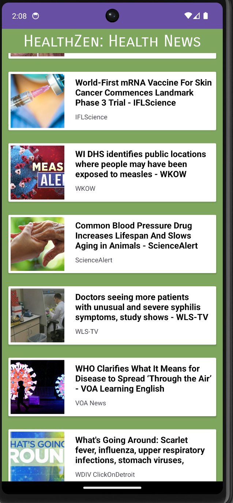
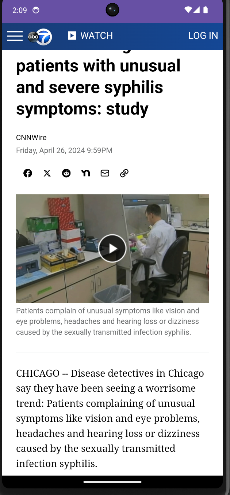

# Welcome to HealthZen!

HealthZen is not just another mobile application; it's your ultimate companion in the world of healthcare. Designed specifically for healthcare professionals, HealthZen aims to support your professional growth, enhance your well-being, and help you achieve that elusive work-life balance.

## Android Development Tools 🛠️

- **Android Studio**: Your go-to IDE for Android development, making app creation a breeze.
- **Kotlin**: The programming language of choice for crafting sleek and efficient Android apps.

## App Overview 📱

HealthZen offers a plethora of features to cater to your needs:

- **News**: Stay up-to-date with the latest healthcare news and industry developments.
    

        
        
    

- **Education**: Access a treasure trove of educational materials to sharpen your professional skills.
      

        
        
      

- **Meditation**: Find your inner peace with mindfulness and meditation techniques tailored for healthcare professionals.
  

        
        
    

- **Relaxing Music**: Unwind and destress with a curated selection of soothing tunes.
  

        
        
    

- **Community**: Connect with like-minded healthcare professionals, share experiences, and seek advice.
  

        
        
    

- **Profile**: Customize your preferences and settings to tailor your HealthZen experience just the way you like it.
    

        
        
    

## Mobile Development 📱

### Features 🌟

- **Authentication**: Securely log in with Firebase Authentication via email/password or Google.
- **Database**: Store user data seamlessly with Firebase Firestore.
- **Forget Password**: Easily reset your password through email.
- **Main Page**: Your gateway to everything HealthZen, including news, calendar, music, and meditation.
- **Bottom Navigation**: Effortlessly navigate through the app's sections with intuitive bottom navigation.
- **Splash Activity**: Start your HealthZen journey with a visually appealing splash screen.
- **Networking**: Seamlessly handle network requests with Retrofit and OkHttpClient.

### Community Page 👥

The Community Page is where the magic happens:

- **Post**: Share your thoughts, experiences, and insights with the HealthZen community.
- **Comment**: Engage in lively discussions by commenting on posts and exchanging ideas.
- **Firebase Firestore**: The powerhouse behind post management, ensuring a smooth and seamless user experience.

## Let's Get Started! 🚀

HealthZen is more than just an app; it's a community, a support system, and a sanctuary for healthcare professionals. Join us on this journey to professional growth, well-being, and balance. Download HealthZen now and embark on your path to a healthier, happier you! 🌟👩‍⚕️👨‍⚕️

**Note:** For collaborative development, feel free to explore our GitHub repository. Together, we can make HealthZen even better! 💪🤝

[Download HealthZen](#) | [GitHub Repository](#)
